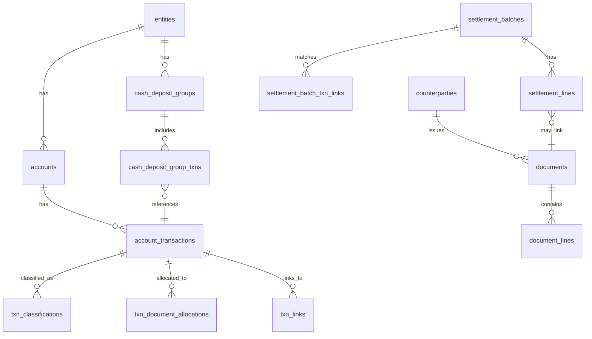

# T2 SOT DB — Architecture & Guardrails

This document exists to prevent “LLM drift” and human confusion. It defines:
- what the Source-of-Truth (SOT) DB is (and is not),
- the sign conventions and invariants,
- how evidence vs canonical data works,
- how to reproduce outputs deterministically.

## 1) Purpose / Non-goals

**Purpose**
- Create a **fresh SQLite source of truth** for FY2024 + FY2025 corporate T2 work.
- Unify reconciliation results (debits + credits + CC chains + settlements + cash logic) into a single schema.
- Make all reconciliation “work” explicit as data rows, not hidden in one-off scripts.

**Non-goals (for now)**
- Perfect line-item categorization for every retail receipt.
- Full portability to `curlys-books` Postgres (can be revisited later).
- “Balancing by force” (no silent number edits; every adjustment must be represented explicitly).

## 2) Canonical inputs

This SOT pipeline reads **one frozen input DB**, and does not modify it:
- Source DB: `../db/t2_final.db`

That DB contains mirrored tables from Fresher reconciliation:
- `fresher_debits__*` (bank/cc parsing, Wave matches, PAD parsing, shareholder classifications, etc.)
- `fresher_credits__*` (Shopify payouts, gateway reports, GFS EFT notices, cash deposit grouping, etc.)

The importer converts those into SOT tables with strict conventions.

## 3) Sign conventions (critical)

These conventions are what keep the system auditable and prevent double-counting.

### 3.1 `account_transactions.amount_cents`
Signed as the line appears on that account statement:
- `+` = inflow / credit on the statement
- `-` = outflow / debit on the statement

This holds for **bank**, **credit card**, **debit card**, and **cash pseudo-account**.

### 3.2 `documents.total_cents`
Signed as the document represents an economic charge:
- Bills/invoices are usually `+`
- Credit memos can be `-`

### 3.3 `txn_document_allocations.amount_cents`
**Must have the same sign as the transaction** it belongs to:
- bank debit paying a bill → allocation is negative
- bank credit from a refund/credit memo → allocation is positive

### 3.4 `settlement_lines.amount_cents`
Signed as shown on the settlement notice:
- invoices = `+`
- credit memos = `-`

For vendor settlements like GFS/PAD, the bank cash movement is typically the opposite direction, so the canonical allocation uses:
- `canonical_allocation = - settlement_line.amount_cents`

## 4) Evidence vs canonical (“two-layer truth”)

The SOT DB deliberately stores two layers:

### Evidence layer
Imported directly from prior work (may include duplicates or conflicting link types):
- `txn_document_allocations.role = 'EVIDENCE'`
- `txn_links.role = 'EVIDENCE'`
- `txn_classifications.role = 'EVIDENCE'`

Evidence is **never edited**. If something is wrong in evidence, we add canonical rows (or later: explicit overrides), we don’t mutate evidence.

### Canonical layer
Deterministic “best view” derived from evidence + settlement primitives:
- `txn_document_allocations.role = 'CANONICAL'`

Canonical allocations are regenerated by script and used for readiness reports.

## 5) Schema overview (Mermaid)

## 6) Reproducible workflow (scripts)

All scripts live in `sot/scripts/`.

1) Initialize schema:
- `python3 sot/scripts/00_init_db.py`

2) Import frozen reconciliation state (read-only input):
- `python3 sot/scripts/10_import_from_t2_final_db.py --reset`

3) Build canonical allocations (no guessing; only re-encoding existing relationships):
- `python3 sot/scripts/20_build_canonical_allocations.py --reset`
  - Uses `sot/overrides/ignore_wave_bills.json` (applied as `document_flags`) to avoid double-counting duplicates.

4) Bank coverage/readiness report:
- `python3 sot/scripts/21_report_bank_coverage.py`
  - Output: `sot/output/bank_canonical_coverage_summary.md`
  - Output: `sot/output/bank_canonical_needs_review.csv`

5) Pull Wave bill dates for specific vendors (for locating physical receipts):
- `python3 sot/scripts/30_list_wave_vendor_dates.py --vendor "canadian tire" --vendor "dollarama" --vendor "wholesale club"`

## 7) Canonical allocation rules (current)

Canonical allocation selection for bank txns (FY2024–FY2025 scope):

1) **Settlement-first**
   - If the bank txn is linked to `GFS_EFT` settlement batch(es), allocate via settlement lines.
   - Else if linked to any `*_PAD` settlement batch(es), allocate via settlement lines.

2) **Credit card chain derived**
   - If the bank txn is a card payment (`BANK_TO_CARD_PAYMENT` link exists), allocate to documents by walking:
     `bank -> card payment -> purchases -> purchase->document evidence allocations`.

3) **Direct evidence fallback**
   - Prefer `fresher_debits__split_payments`, then `fresher_debits__wave_bill_funding`, then `fresher_debits__wave_matches`.
   - Guardrails:
     - Dedupe by `document_id`.
     - Drop allocations where `abs(allocation_amount) > abs(document.total_cents)`.

Anything not allocatable to documents is still expected to be explained by:
- `txn_classifications` (e.g. HST remits, payroll remits, shareholder activity), and/or
- settlement links (e.g. Shopify payout deposits).

## 8) What this enables next (TB/GIFI)

This SOT DB now has the **structure** required to:
- generate journal entries from bank activity + documents + settlement components,
- build a trial balance per FY,
- map accounts to GIFI codes and generate schedules.

That work is intentionally not “auto-filled” yet; the goal is to preserve truth and auditability first.
